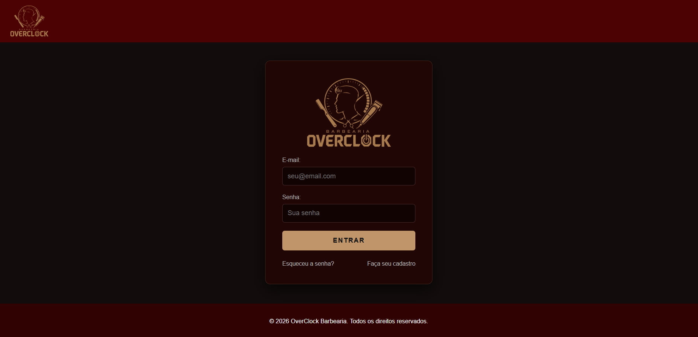
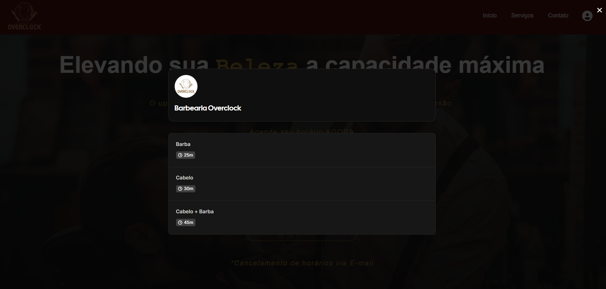
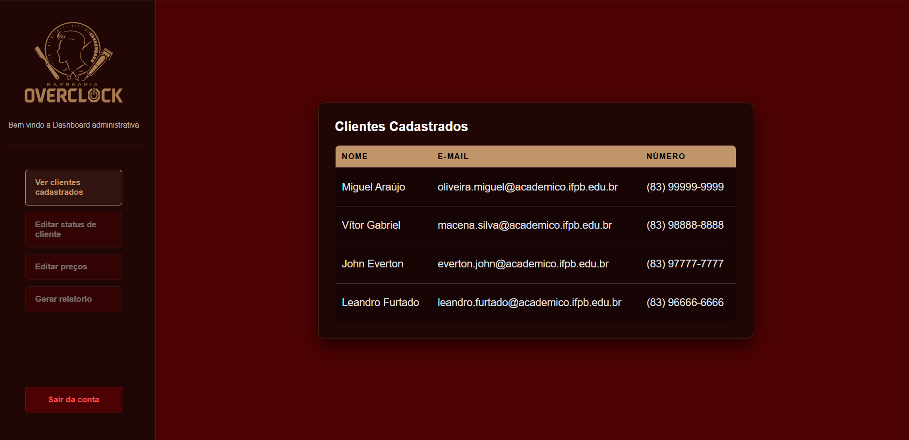
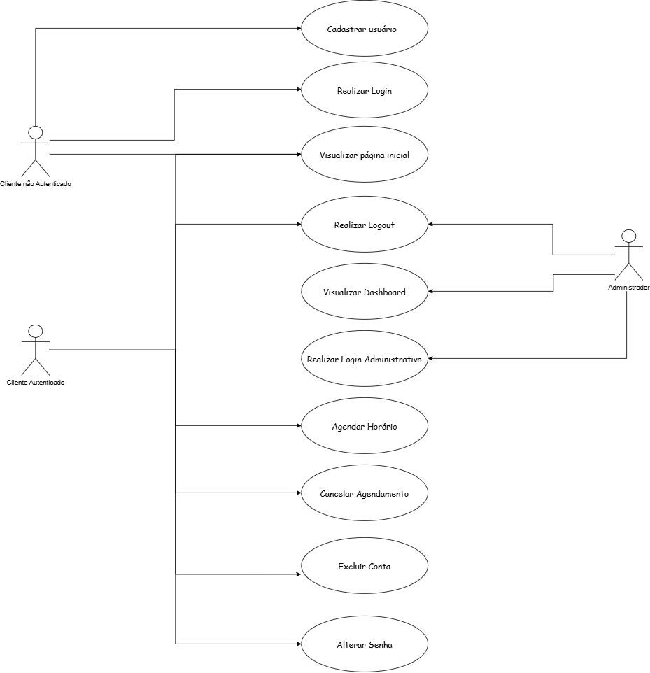
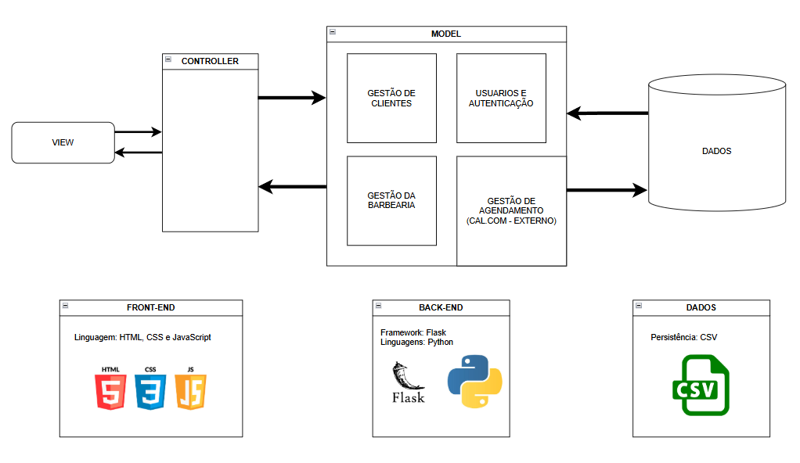

# BARBEARIA OVERCLOCK

BARBEARIA OVERCLOCK é uma aplicação web desenvolvida com **Flask (Python)** que simula um **sistema de gerenciamento e agendamento para uma barbearia moderna**, permitindo a visualização de serviços, tabela de preços, informações de contato, além de funcionalidades de **autenticação de usuários**, **perfil do cliente** e um **painel de controle** para administração dos usuários cadastrados.

O projeto foi desenvolvido seguindo boas práticas de desenvolvimento, versionamento com Git/GitHub e modelagem de requisitos.

---

## Visão Geral do Projeto

A aplicação oferece uma interface web responsiva, organizada e intuitiva, integrando frontend e backend de forma consistente, com uma identidade visual marcante em tons escuros, vinho e dourado voltada ao público moderno.

### Página Principal (Home)

A página inicial reúne a apresentação da marca, a tabela dinâmica de serviços e preços, e as informações institucionais de contato no rodapé.


---

## Autenticação de Usuário

O sistema permite **cadastro, login e logout de usuários** (clientes e administradores), com controle de sessão seguro e **restrição de acesso** a rotas específicas.



---

---

## Agendamento de Horários

Após efetuar o login com sucesso, o sistema libera o botão de agendamento na interface do usuário. Ao clicar nele, o cliente tem acesso a uma **tela de seleção interativa para escolher o serviço desejado (Barba, Cabelo ou Combo), que detalha o tempo estimado de duração de cada atendimento**.



---

## Painel de Controle (Admin)

O sistema conta com um painel administrativo restrito que permite aos gerenciadores da barbearia ter o controle centralizado de todos os usuários do sistema, listando de forma organizada os dados dos clientes cadastrados.



---

## Funcionalidades Principais

### Institucional & Catálogo
- Landing page com temática exclusiva 
- Exibição integrada de serviços (Corte, Barba e Combo) e seus respectivos preços
- Informações de endereço e contato (E-mail e Telefone) centralizadas no rodapé

### Autenticação
- Cadastro de novos clientes
- Login e logout de usuários com controle de sessão
- Controle de níveis de acesso (Cliente vs. Administrador)

### Agendamentos
- Escolha de data e serviço específico
- Validação de horários em tempo real (bloqueio de horários já ocupados)
- Confirmação visual do agendamento

### Painel de Controle (Backoffice)
- Visualização e listagem em tempo real de todos os clientes cadastrados no sistema

---

## Modelagem de Requisitos

### Diagrama de Casos de Uso (UML)

O diagrama abaixo apresenta a **modelagem geral dos casos de uso do sistema**, separando as ações que o Cliente pode fazer das ações exclusivas do Administrador no painel.



---

## Arquitetura do Sistema

O projeto segue uma **arquitetura em camadas (MVC)**, separando responsabilidades entre apresentação, controle, lógica de negócio e persistência de dados.

### Visão Arquitetural



---

## Instalação e Execução

### Pré-requisitos
- Python 3.x
- Git

### Passos

```bash
# Clonar o repositório
git clone https://github.com/MiguelAraujo3/OverClock.git

# Entrar na pasta do projeto
cd barbearia-overclock

# Criar o ambiente virtual
python -m venv venv

# Ativar o ambiente virtual (Windows)
venv\Scripts\activate

# Ativar o ambiente virtual (Linux/Mac)
source venv/bin/activate

# Instalar as dependências
pip install -r requirements.txt

# Executar a aplicação
python main.py
```

### Configuração do ambiente

Crie um arquivo **.env** na raiz do projeto e adicione as seguintes variáveis:

```bash
MAIL_USERNAME=SEU_EMAIL
MAIL_PASSWORD=SUA_SENHA_DE_APP_DO_EMAIL
FLASK_SECRET_KEY=sua_chave_secreta_overclock_aqui
```

**Obs: é necessário colocar a senha de app do email**

### Execução da aplicação

```bash
python main.py
```

# A aplicação estará disponível em:

http://localhost:5000
